## 🥦 Be Fresh : 냉장고의 음식 단속

**스마트 용기를 통한 식품 신선도 관리 시스템**

- 👪 기관: 삼성 청년 SW 아카데미     
- 📆 기간: 2024.04.08 ~ 2024.05.20

### **💡 목표**
>
> 소비자들이 식품의 신선도를 정확히 알고, 보다 효율적으로 음식 관리를 할 수 있게 함으로써 음식물 쓰레기를 줄여 경제적 이득 및 환경 보호에 기여합니다. 
>

### 목차
|
No
|
내용
|
|:----:|:----:|
|**1**|[**💡 프로젝트 개요**](#1)
|**2**|[**🥨 주요 기능**](#2)
|**3**|[**🍗 기대 효과**](#3)
|**4**|[**🔍 기술 스택**](#4)
|**5**|[**💾 DataBase**](#5)
|**6**|[**📂 시스템 아키텍처**](#6) 
|**7**|[**📱 기술 소개**](#7)
|**8**|[**👪 팀 소개**](#8)
|**9**|[**🗂️ Directory 구조**](#9)

### **💡 프로젝트 개요**

> 유통 과정에서의 불법 행위나 소비자의 잘못된 보관 방법 등으로 인해 식품의 신선도가 유통기한과 다를 수 있습니다. 이러한 문제를 해결하고자, 저희는 스마트 용기를 통해 식품의 실시간 데이터를 모니터링하여 **소비자에게 정확한 신선도 정보를 제공**하고자 합니다.
>

### **🥨 주요 기능**

- **STT를 통한 음식 등록:** 사용자는 냉장고에 부착된 마이크를 통해 음식 이름을 말해서 등록할 수 있습니다.
- **OCR 기능:** 포장지에 인쇄된 유통 기한을 인식하여 자동으로 등록합니다.
- **일반적인 유통기한 제공:** 등록된 음식에 대한 일반적인 유통기한 정보를 제공합니다.
- **실시간 데이터 모니터링:** 냉장고 내의 스마트 용기에 부착된 센서를 통해 식품의 기체 배출량, 온도 등을 수집 및 분석합니다.
- **통계 분석을 통한 식품 신선도 측정**: R 통계 분석 기법을 활용하여 검출된 기체의 농도 데이터를 기반으로 신선도를 분류합니다.
- **식품 신선도 및 부패 감지 알림:** 특정 기체(암모니아 등)의 농도를 분석하여 신선도 저하 및 부패 시작을 감지하고 소비자에게 알림을 전송하고, 정보를 제공합니다.
- **음식 상태 모니터링 서비스:** 소비자가 자신의 음식 상태를 모니터링 할 수 있게 하며, 신선도, 유통 기한 등의 정보를 제공합니다.

**[ 시연용 결과물 ]**

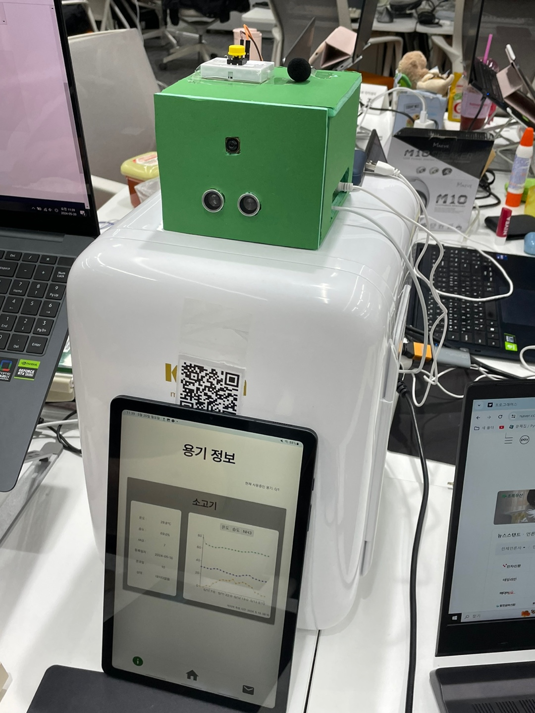

**[ 어플 메인 화면 ]**

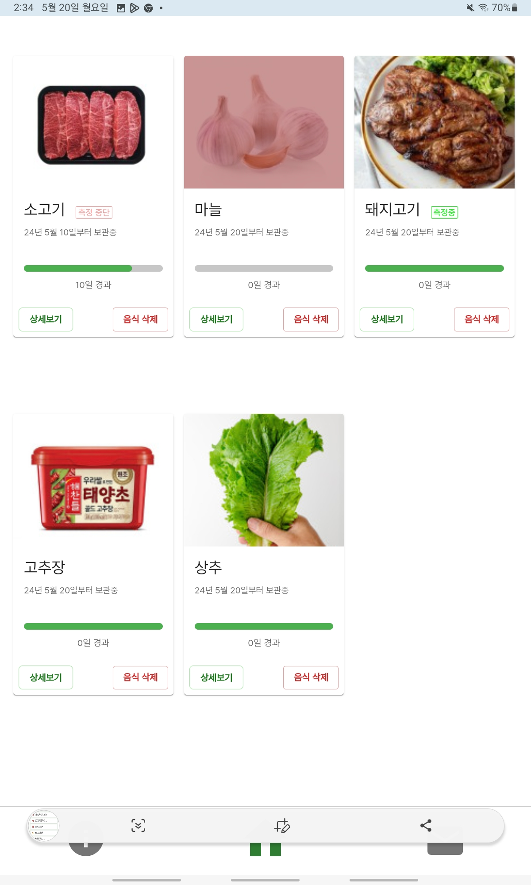

**[ 어플 용기 정보 ]**

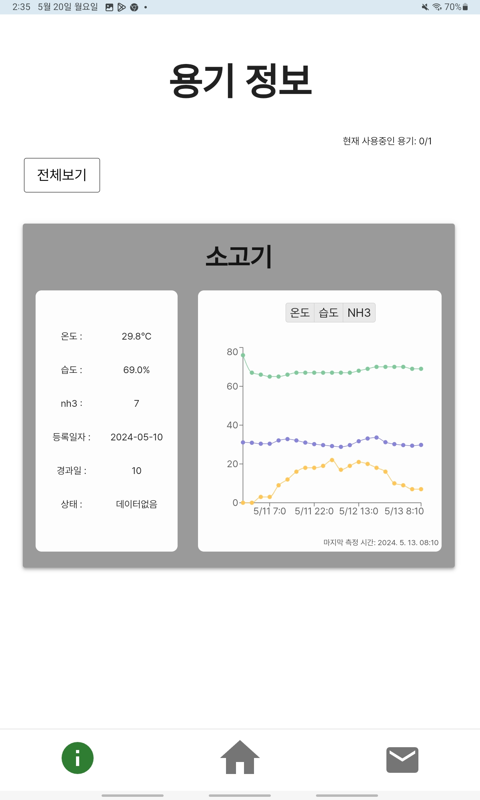

**[ 어플 알림 화면 ]**

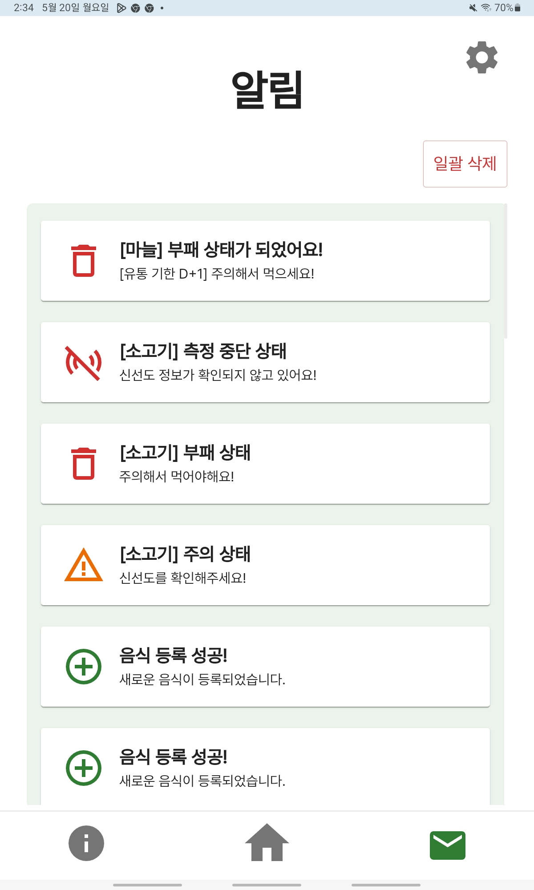

### **🍗 기대 효과**

- **음식의 신선도 확인 간소화:** 스마트폰이나 냉장고에 부착된 태블릿을 통해 간편하게 신선도 확인이 가능합니다.
- **경제적 이득과 환경 보호:** 식품의 정확한 신선도 파악으로 불필요한 음식물 쓰레기를 줄이고, 결과적으로 경제적 이득 및 환경 보호에 기여합니다.
- **사용자 경험 향상:** 식품의 신선도 관리를 자동화함으로써 사용자의 편의성과 만족도를 크게 향상시킵니다.

### **🔍 기술 스택**
**FrontEnd**

  
    

**BackEnd**

       

**IOT**

   

**Data**

  

**Infra**

     

**Collaboration Tool**

     

### 💾 DataBase

**[oracle DB]**

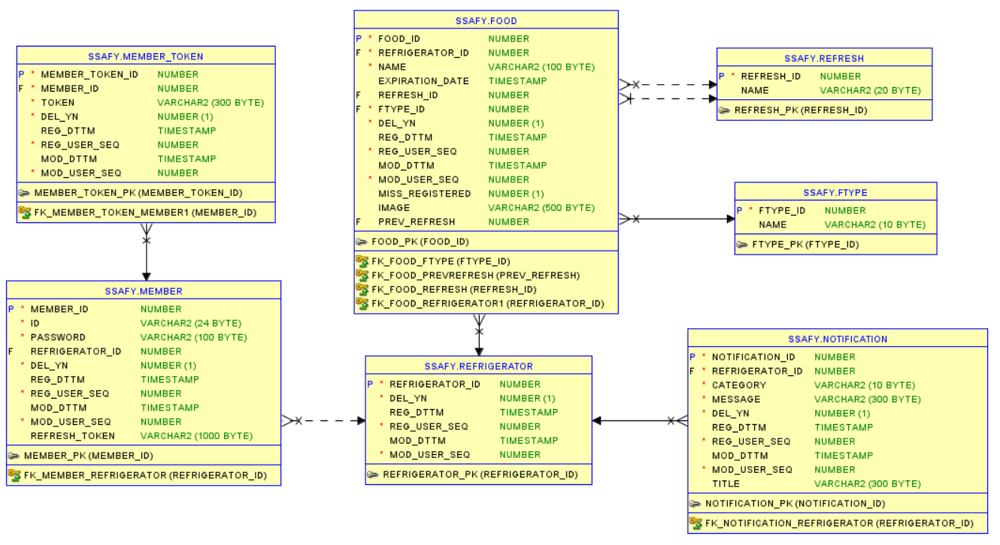

**[influx DB]**

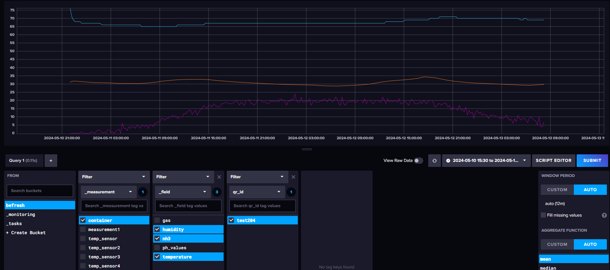

### 📂 시스템 아키텍처

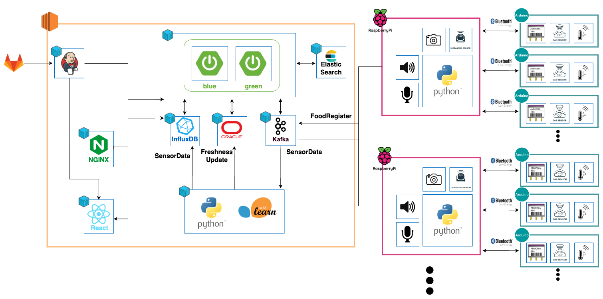

### 📱 기술 소개

**[ IOT - Asyncio / Multiprocessiong ]**

> 냉장고 모듈에서 처리하는 프로세스가 동기적으로 진행된다면 대기시간이 길어지기 때문에 Asyncio, Multiprocessing을 사용합니다.

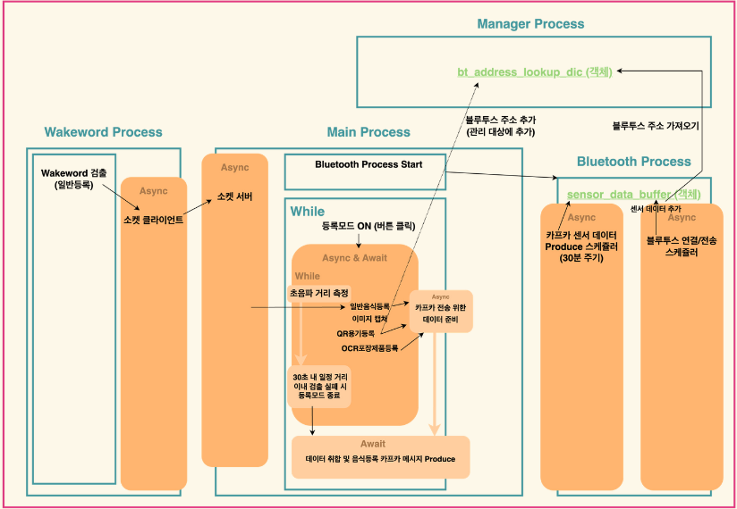

- **Asyncio**: IO 블로킹시 다른 CPU 작업 수행, IO 작업 이점
- **Multiprocessiong**: 별도의 프로세스를 사용하여 멀티 코어의 경우 CPU 작업 이점

**[ IOT - Bluetooth Job 스케쥴링 ]**

> 하나의 냉장고가 여러 개의 스마트 용기가 순차적으로 블루투스 통신을 해야하기 때문에 Bluetooth Job 스케쥴링을 적용했습니다.

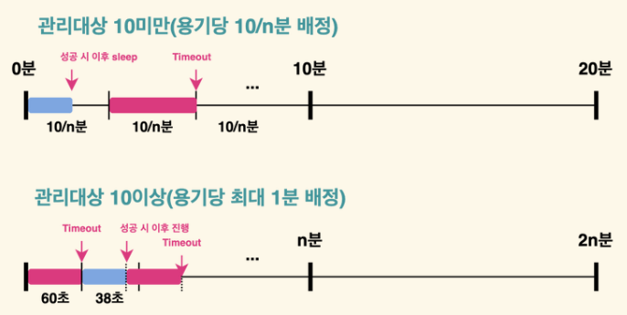

- 10대 이상으로 증가할 경우 자동으로 로직 변경    
=> 최악의 경우에도 n분 주기로 용기당 60초 배정

**[ Kafka ]**
>
> 1. 냉장고에서 등록할 음식 목록을 Publish 하면, 구독 중인 Spring 서버가 메시지를 받아 음식을 등록합니다.
> 2. 냉장고에서 센서 데이터를 Publish하면, 구독 중인 파이썬 서버가 수신하여 신선도를 계산합니다.
>

- RestAPI: 트래픽 증가시 타임아웃 및 메시지 유실 가능성이 존재

- Kafka: 수신자가 본인의 처리 속도에 맞게 메시지를 수신 가능

**[ Elastic Search ]**

> STT로 음식을 등록하는 과정에서, 음식 이름의 오차를 줄이고 음식에 대한 유통기한을 반환하기 위해 Elastic Search 검색 엔진을 구현하였습니다.

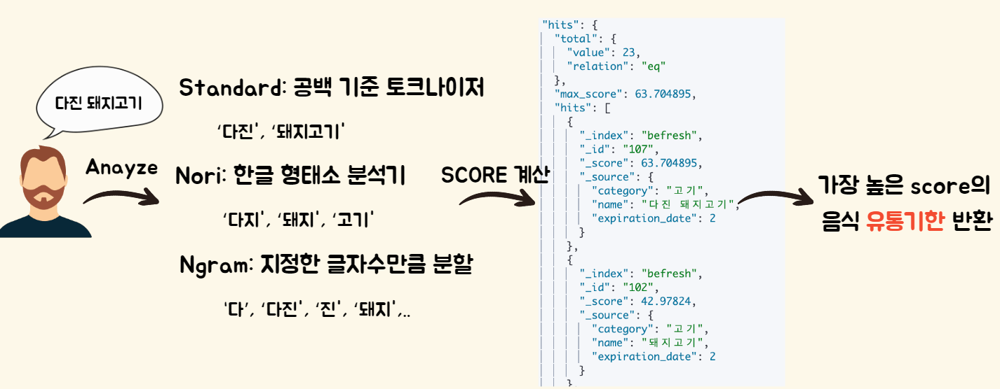

**[ Spring - Virtual Thread ]**

> 스프링 서버에서 병렬 처리를 위해 음식 등록 과정을 비동기처리로 구현하였습니다. 또한, 성능 향상을 위해 생성 비용이 작고, 논블로킹 방식인 Virtual Thread를 적용했습니다.

- 1000개의 요청에 대한 응답시간 및 처리량
    - 플랫폼 스레드 처리량: 10.9/sec

    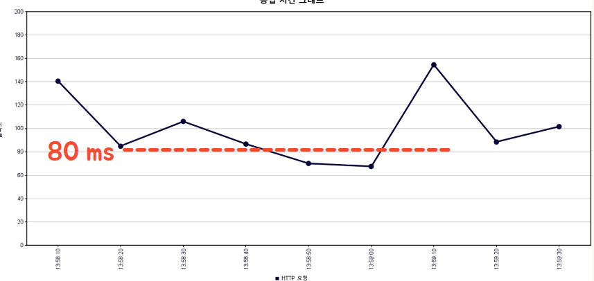

    - 가상 스레드 처리량: 20.2/sec

    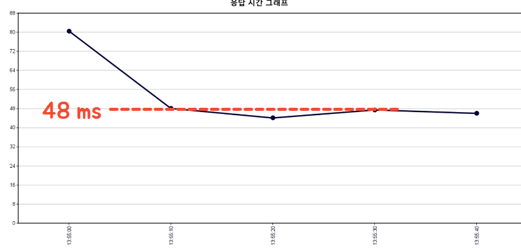
    => 플랫폼 스레드에 비해 더 높은 처리량과 빠른 응답시간

**[ Spring Batch ]**

> 유통기한 및 센서 데이터를 기반으로 상태를 주기적으로 업데이트 하고 알림을 전송하기 위해 Spring Batch를 도입하였습니다.

- 데이터 처리 안전성 보장
- 데이터 일관성 유지 가능
- 모니터링 및 관리 가능

**[ Python - 신선도 예측 ]**

> 용기의 센서를 통해 온도, 습도, 가스 센서 데이터를 수집합니다. 가스 센서를 통해 훈련시킨 Random Forest Model로 pH 센서를 예측하여 신선도를 분류합니다.

- pH가 5.9이하는 신선, 5.9 ~ 6.2는 주의, 6.2 이상은 부패로 분류합니다.

- **Random Forest Model**
    > 센서로 얻은 데이터를 통해 PH 값을 예측합니다.

    - train을 위한 데이터 수집

    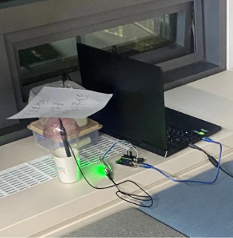

    - 선정 이유
        - NH3, 가스 등 다양한 변수들 간의 복잡한 상호작용을 고려할 수 있습니다.
        - 시간에 따른 데이터 변화를 처리할 수 있습니다.
        - 변수 중요도를 계산할 수 있습니다.

    => Accuracy가 약 92%로, 높은 정확도를 보입니다.

**[PWA + FCM]**

> 음식의 신선도 상태, 등록 확인, 연결의 끊김 등의 알림을 사용자에게 전달하기 위해 PWA와 FCM을 도입하였습니다.

- **PWA**: Progressive Web Application의 약자로, 웹의 장점과 앱의 장점을 모두 가짐. 대표적인 기능으로는 설치를 통해 앱처럼 사용 가능, 푸시 알림, 오프라인에서의 동작 등이 있습니다.
- **FCM**: 파이어베이스 기반 웹 푸시 서비스로, 서버에서 클라이언트 앱으로 메세지를 전달하는 기능을 제공합니다.

- PWA를 통해 백그라운드 환경에서도 사용자들에게 푸시 알림을 전송하고, 모바일의 카메라를 활용할 수 있습니다.
- 메시지를 Redux에 저장하여 새로고침 없이 알림을 확인할 수 있습니다.

**[ Atomic Design, Styled Components ]**

> 코드 재사용성과 유지보수성을 높이기 위해 Atomic Design과 Styled Components를 도입하였습니다.

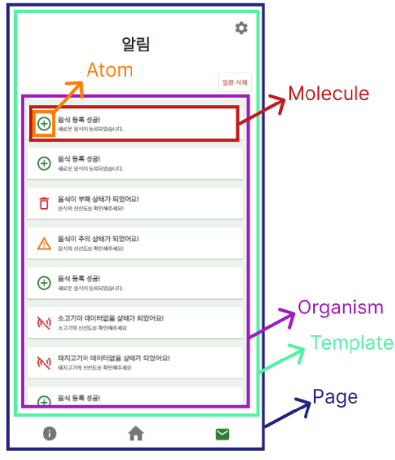

- 각 컴포넌트에서 쉽게 CSS 확인이 가능합니다.
- CSS의 오염을 최소화합니다.

### 👪 팀 소개

|||||||
|:----:|:----:|:----:|:----:|:----:|:----:|
|[정승환 (팀장)](https://github.com/seunghw2)|[하동준](https://github.com/djh0211)|[남수진](https://github.com/ss0510s)|[김예지](https://github.com/gimezi)|[정유경](https://github.com/YuKyung-Chung)|[김동현](https://github.com/Chico0902/)|

|
이름
|
역할
|
개발 내용
|어려웠던 점과 배운 점|
|:----:|:----:|----|----|
|정승환|BackEnd|||
|남수진|BackEnd|||
|정유경|BackEnd + Infra|||
|하동준|BackEnd + IOT|||
|김예지|FrontEnd + IOT|||
|김동현|FrontEnd|||

### 🗂️ Directory 구조